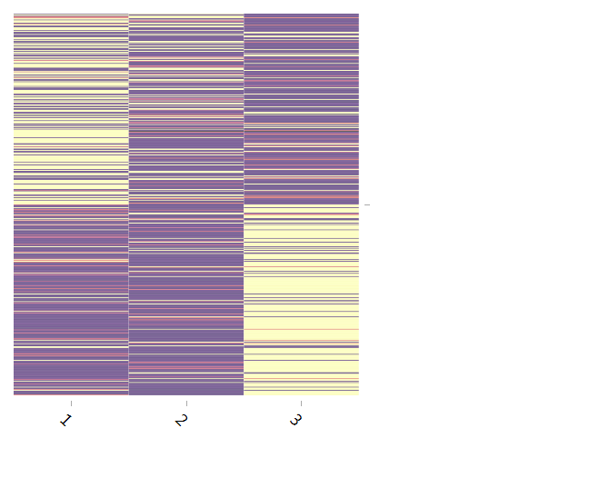

```{r setup, include=FALSE}
knitr::opts_chunk$set(message=F, error=F, warning=F, comment=NA, R.options=list(width=120), cache=T)
```

```{r setup_heat, echo=FALSE}
library(htmltools)
tags$style(".d3heatmap { margin-left: auto; margin-right: auto; }")
tags$style(".plotly { margin-left: auto; margin-right: auto; width=75%}")
```

```{r setup_other, echo=FALSE}
library(pander) # note, something about the recent dplyr change has broken pander for tibbles (along with many other things)
```

# Introduction


This is a brief demonstration of a standard [latent dirichlet allocation](https://en.wikipedia.org/wiki/Latent_Dirichlet_allocation) (LDA) for <span class="emph">topic modeling</span>, geared toward those who want to dig a little deeper than merely getting a result from a package command. The basic idea is to first generate some documents based on the underlying model, and then we'll use the <span class="pack">topicmodels</span> package to recover the topics via LDA.  You can find a basic overview of topic models in a variety of places, and I'll eventually have a chapter in my [graphical and latent variable models document](http://m-clark.github.io/docs/sem). 

Suffice it to say, one can approach this in (at least) one of two ways. In one sense, LDA is a dimension reduction technique, much like the family of techniques that includes PCA, factor analysis, non-negative matrix factorization etc.  We'll take a whole lot of terms, loosely defined, and boil them down to a few topics.   In this sense LDA is akin to discrete PCA.  Another way to think about this is more from the  perspective of factor analysis, where we are keenly interested in interpretation of the result, and want to know both what terms are associated with which topics, and what documents are more likely to present which topics.  The following is the plate diagram and description for standard LDA from Blei, Jordan, and Ng (2003).


- $\alpha$ is the parameter of the Dirichlet prior on the per-document topic distributions
- $\eta$  is the parameter of the Dirichlet prior on the per-topic word distribution
- $\theta_m$ is the topic distribution for document $m$
- $\beta_k$ is the word distribution for topic $k$
- $z_{mn}$ is the topic for the $n$-th word in document $m$
- $w_{mn}$ is the specific word

Both $z$ and $w$ are from a multinomial draw based on the $\theta$ and $\beta$ distributions respectively.  For a given document, one draws a topic, and given the topic, words are drawn from it.

# Generating Documents

In the standard setting, to be able to conduct such an analysis from text one needs a <span class="emph">document-term matrix</span>, where rows represent documents, and columns terms.  Terms are typically words but could be any <span class="emph">n-gram</span> of interest.  In practice, this is where you'll spend most of your time, as text is never ready, and must be scraped, converted, stemmed, cleaned etc.  In what follows we'll be generating the text based on the underlying topic model. We'll initially create $\theta$ and $\beta$ noted above, then given those, draw topics and words given topics based on the multinomial distribution.  I've tried to keep the code general enough to make it easy to play with the parameter settings.


## Topic Probabilities

We begin the simulation by creating topic probabilities. There will be $k=3$ topics. Half of our documents will have probabilities of topics for them ($\theta_1$) which will be notably different from the other half ($\theta_2$).  Specifically, the first half will show higher probability of topic 'A' and 'B', while the second half of documents show higher probability of topic 'C'. What we'll end up with here is an $m$ x $k$ matrix of probabilities $\theta$ where each $m$ document has a non-zero probability for each $k$ topic.  Note that in the plate diagram, these would come from a $\mathcal{Dirichlet}(\mathbf{\alpha})$ draw rather than be fixed like this, but hopefully this will make things clear starting out. Later we will use the Dirichlet for the terms. 


```{r topic_probabilities}
# Note that in what follows, I strive for conceptual clarity, not code efficiency.
library(tidyverse)

Ndocs = 500                                        # Number of documents
WordsPerDoc = rpois(Ndocs, 100)                    # Total words/terms in a document
thetaList = list(c(A=.60, B=.25, C=.15),           # Topic proportions for first and second half of data 
                 c(A=.10, B=.10, C=.80))           # These values represent a Dir(alpha) draw
theta_1 = t(replicate(Ndocs/2, thetaList[[1]]))
theta_2 = t(replicate(Ndocs/2, thetaList[[2]]))
theta = rbind(theta_1, theta_2)                    # Topic probabilities for all 500 docs
```

If you like, the following will use the Dirichlet explicitly, and amounts to the same thing but with randomness thrown in.

```{r theta_via_dirichlet, eval=F}
theta_1 = t(replicate(Ndocs/2, rdirichlet(1, c(6, 2.5, 1.5)), simplify=T))
theta_2 = t(replicate(Ndocs/2, rdirichlet(1, c(1, 1, 8)), simplify=T))
```


## Topic Assignments and Labels

With topic probabilities in hand, we'll draw topic assignments from a <span class="emph">categorical distribution</span>, which, for those not in computer science, is the multinomial with `size=1` (see the commented line at the end). 

```{r topic_assign}
firsthalf = 1:(Ndocs/2)
secondhalf = (Ndocs/2+1):Ndocs

Z = t(apply(theta, 1, rmultinom, n=1, size=1))    # draw topic assignment
colMeans(Z[firsthalf,])                           # roughly equal to theta_1
colMeans(Z[secondhalf,])                          # roughly equal to theta_2

z = apply(Z, 1, which.max)                        # topic assignment as arbitrary label 1:3
# z = apply(theta, 1, function(topprob) extraDistr::rcat(1, topprob)) # topic assignment via categorical dist
```


## Topics

Next we need the topics themselves. Topics are probability distributions of terms, and in what follows we'll use the Dirichlet distribution to provide the prior probabilities for the terms. With topic A, we'll make the first ~40% of terms have a higher probability of occurring, the last ~40% go with topic C, and the middle more associated with topic B. To give a sense of the alpha settings, `alpha=c(8,1,1)` would result in topic probabilities of .8, .1, .1, as would `alpha=c(80,10,10)`, though the latter would serve as a much stronger prior. We'll use the <span class="pack">gtools</span> package for the <span class="func">rdirichlet</span> function. I also provide a visualization, where the dark represents terms that are notably less likely to be associated with a particular topic.

```{r topic_dist}
Nterms = max(WordsPerDoc)
breaks = quantile(1:Nterms, c(.4,.6,1)) %>% round()
cuts = list(1:breaks[1], (breaks[1]+1):breaks[2], (breaks[2]+1):Nterms)

library(gtools)

B_k = matrix(0, ncol=3, nrow=Nterms)

B_k[,1] = rdirichlet(n=1, alpha=c(rep(10, length(cuts[[1]])),       # topics for 1st 40% of terms
                                    rep(1,  length(cuts[[2]])),
                                    rep(1,  length(cuts[[3]]))))
B_k[,2] = rdirichlet(n=1, alpha=c(rep(1,  length(cuts[[1]])),       # topics for middle 20%
                                    rep(10, length(cuts[[2]])),
                                    rep(1,  length(cuts[[3]]))))
B_k[,3] = rdirichlet(n=1, alpha=c(rep(1,  length(cuts[[1]])),       # topics for last 40%
                                    rep(1,  length(cuts[[2]])),
                                    rep(10, length(cuts[[3]]))))
```

```{r display_B, echo=FALSE, eval=FALSE}
# d3heatmap::d3heatmap(B_k, Rowv = NA, Colv = NA, labRow=rep(NA, Nterms), 
#                      colors=viridis::inferno(n=100),
#                      width=500, show_grid=F)
library(heatmaply)

heatmaply(B_k, Colv=NA, Rowv=NA, colors=viridis::inferno(100),
          showticklabels=F, symm=F, hide_colorbar=T, plot_method='plotly',
          fontsize_row=0, fontsize_col=0)
```


<br>

Now, given the topic assignment, we draw words for each document according to its size via a multinomial draw.

```{r generate_words}
wordlist_1 = sapply(1:Ndocs, 
                    function(i) t(rmultinom(1, size=WordsPerDoc[i], prob=B_k[,z[i]]))  
                    , simplify = F)  

# smash to doc-term matrix
dtm_1 = do.call(rbind, wordlist_1)
colnames(dtm_1) = paste0('word', 1:Nterms)

# bag of words representation
wordlist_1 = lapply(wordlist_1, function(wds) rep(paste0('word', 1:length(wds)), wds))   
```

<br>
Here's a glimpse of the document-term matrix.

```{r dtm, echo=FALSE}
DT::datatable(dtm_1, options=list(scrollX=T, dom='tp'), rownames=paste0('document_', 1:Ndocs))
```


And here's what the first document looks like.

```{r bow_pretty, echo=FALSE}
table(wordlist_1[[1]]) %>% 
  data.frame() %>% 
  arrange(desc(Freq)) %>% 
  rename(Term=Var1) %>% 
  head(8) %>% 
  pander()
```

<br>

With a matrix approach, we don't need an explicit topic label, just the topic indicator matrix and topic probabilities. I will let you see this for yourself that the results are essentially the same, but we'll just stick to the previous results for this demo.

```{r topic_matrix}
ZB = tcrossprod(Z, B_k)                                                
dtm_2 = t(sapply(1:Ndocs, function(i) rmultinom(1, WordsPerDoc[i], ZB[i,])))
wordlist_2 = apply(dtm_2, 1, function(row) rep(paste0('word', which(row!=0)), row[row!=0]) )

colnames(dtm_2) = paste0('word', 1:Nterms)
```

<!-- Just out of curiosity, we can see how these two random instances of topics and words line up. -->

<!-- ```{r, eval=FALSE} -->
<!-- # overlap of words -->
<!-- nWordOverlap = rep(NA, Ndocs) -->
<!-- percWordOverlap = rep(NA, Ndocs) -->
<!-- for (i in 1:Ndocs){ -->
<!--   nWordOverlap[i]    = length(intersect(wordlist_1[[i]], wordlist_2[[i]])) -->
<!--   percWordOverlap[i] = length(intersect(wordlist_1[[i]], wordlist_2[[i]])) / -->
<!--                        length(unique(c(wordlist_1[[i]],  wordlist_2[[i]]))) -->
<!-- } -->
<!-- summary(nWordOverlap) -->
<!-- summary(percWordOverlap) -->
<!-- ``` -->


# Topic Models

We're now ready to run the models.   Depending on the number of documents, terms, and other settings, it is possible to get an unsatisfactory/random result. Usually a redo is enough to recover topic probabilities, but the commented settings are an attempt to get better result from the outset.  However, they will notably slow things down.

```{r run_lda, eval=F, echo=1:4}
library(topicmodels)
controlSettings = list(nstart=10, verbose=100)
# others var=list(iter.max=5000, tol=10e-8), em=list(iter.max=5000, tol=10e-8)
LDA_1 = LDA(dtm_1, k=3, control=controlSettings)
# LDA_1 = LDA(dtm_1, k=3, method='Gibbs')

# LDA_2 = LDA(dtm_2, k=3, control=controlSettings)

save(LDA_1, file='lda_results.RData')
```

Let's look at the results. To be clear, the topic labels are *completely arbitrary*, so what is topic "1" for one analysis might be topic "3" for another. In this case, they align such that A-1, B-2, and C-3. The main thing for us is the recovery of the distribution of the topics, which will be roughly `r theta_1[1,]` for the first half (arbitrary order), and `r theta_2[1,]` for the other. Visually we can see the expected result, the first half of the documents are mostly associated with the first topic, and a little more so for the second. The last half are mostly associated with the third topic and little else.

```{r lda_results, echo=3}
load('lda_results.RData')
library(topicmodels)
LDA_1Post = posterior(LDA_1)

# with this data of near 0s and near 1s, d3heatmap is basically doing a 2 color 
# plot regardless of input, but color issues with this function are par for the 
# course. The helpfile should really be changed to note that it uses the 
# following unless it's input is a factor (col_factor), which is not even noted
# as an allowable input. UPDATE: d3heatmap is now abandonware. However, colorRamp
# can't be used (apparently) so keeping this particular plot.

#   colors = scales::col_numeric(colors, rng, na.color = "transparent")


d3heatmap::d3heatmap(LDA_1Post$topics, Rowv = NA, Colv = NA, labRow=rep(NA, nrow(LDA_1Post$topics)),
                     colors=colorRamp(viridis::inferno(n=100), interpolate='spline', space='Lab', bias=5), digits=5,
                     width=450, height=368)

# test = LDA_1Post$topics
# test[test<.5] = sqrt(test[test<.5])
# test[test>.5] = (test[test>.5])^2
# heatmaply(test, Rowv = NA, Colv = NA, #labRow=rep(NA, nrow(LDA_1Post$topics)),
#           colors=viridis::inferno(n=500), scale='none',
#           showticklabels=F, symm=F, hide_colorbar=T, #plot_method='ggplot', 
#           fontsize_row=0, fontsize_col=0, 
#           width=500)


# LDA_2Post = posterior(LDA_2)
# d3heatmap::d3heatmap(LDA_2Post$topics, Rowv = NA, Colv = NA, colors=viridis::inferno(n=100))
# library(LDAvis)
# shinyJSON = createJSON(B=exp(LDA_1@beta), theta=LDA_1@gamma, doc.length = WordsPerDoc,
#                        vocab = paste0('word', 1:Nterms), term.frequency = colSums(dtm_1))
# serVis(shinyJSON)
```

<!--  -->

<br>

We can compare our results with the true topic probabilities and see we've recovered things pretty well.

```{r topic_probs, echo=F}
rbind(true_topic_probs_first_half  = thetaList[[1]], 
      true_topic_probs_second_half = thetaList[[2]],
      LDA_1_first_half  = colMeans(LDA_1Post$topics[firsthalf,]), 
      LDA_1_second_half = colMeans(LDA_1Post$topics[secondhalf,])) %>% 
  arm::fround(2) %>% 
  pander(justify='lrrr', width=250)
```
<br>

As another approach to looking at how the documents relate to one another, I calculated their <span class="emph">KL divergence</span> based on the estimated topic probabilities, and show the  (lower triangle) of the resulting distance matrix of documents.  Darker indicates documents that are less alike, and we see the later documents are less like the earliest ones, as we would expect.


```{r kldiv, echo=FALSE, eval=FALSE}
divKLJS = function(input, method='KL'){
  docpairs = combn(1:nrow(input), 2)
  if(method=='KL'){
    apply(docpairs, 2, 
          function(topicprob) .5*sum(topicprob[1]*log2(topicprob[1]/topicprob[2]) 
                                     + topicprob[2]*log2(topicprob[2]/topicprob[1])
          )
    )
  } else{
    apply(docpairs, 2, 
          function(topicprob) .5*sum(topicprob[1]*log2(topicprob[1]/mean(topicprob)) 
                                     + topicprob[2]*log2(topicprob[2]/mean(topicprob))
          )
    )
  }
}


# Now do for all☻
KLdivs = divKLJS(LDA_1Post$topics)
mat0 = matrix(NA, Ndocs, Ndocs)
mat0[lower.tri(mat0)] <- KLdivs
mat0[upper.tri(mat0)] <- t(mat0)[upper.tri(t(mat0))]
KLdivs = mat0; dimnames(KLdivs) = list(row.names(dtm))
# corrplot(KLdivs, diag=T, type='lower', is.corr=F, main='Kullback-Liebler Divergence')
# d3heatmap::d3heatmap(mat0, Colv=F, Rowv=F, colors=viridis::inferno(500, direction=-1), 
#                      labCol=rep('', 500), labRow=rep('', 500), show_grid=F, 
#                      xaxis_height=0, xaxis_font_size=0,
#                      yaxis_height=0, yaxis_font_size=0)
heatmaply(mat0, Colv=NA, Rowv=NA, colors=viridis::inferno(500, direction=-1), 
          showticklabels=F, symm=F, hide_colorbar=T, plot_method='plotly', 
          fontsize_row=0, fontsize_col=0)
```


## tidytext

The <span class="pack">tidytext</span> package can facilitate working with LDA results, as well as doing all the text pre-processing beforehand. As it is relatively new to the scene, I thought it might be useful to demonstrate some of how it works.  The first step would assume your initial data is in 'tidy' format (or what is more typically called 'long' form). In this case, each row represents a word within a document. Additionally we have a column for how many times the word occurs and the document id. Note that I drop 0 counts.  This is because <span class="pack">tidytext</span> will not create a sparse <span class="objclass">dtm</span> object otherwise.

```{r tidytext_example, eval=FALSE}
library(tidytext)
lda_dat_df = dtm_1 %>%
  as_data_frame() %>% 
  mutate(doc=1:n()) %>% 
  gather(key=term, value=count, -doc) %>% 
  filter(count>0) %>%
  arrange(doc)

lda_dat_df
```
```{r tidytext_example_pretty, echo=FALSE}
library(tidytext)
lda_dat_df = dtm_1 %>%
  as_data_frame() %>% 
  mutate(doc=1:n()) %>% 
  gather(key=term, value=count, -doc) %>% 
  filter(count>0) %>%
  arrange(doc)

lda_dat_df %>% head(10) %>% data.frame() %>% pander()
```
<br>
Again, <span class="pack">tidytext</span> will help you get to that state via the initial processing. Once there, you can then create the document term matrix with <span class="func">cast_dtm</span>.

```{r tt_dtm, eval=FALSE}
dtm = lda_dat_df %>%
  cast_dtm(doc, term, count)

dtm
```

<!-- due to cacheing, the following inline stuff will break. Options are to clear cache first, turn off, or use this chunk. -->

```{r cache_fail, echo=FALSE, cache=FALSE}
library(tidyverse); library(tidytext)
dtm = lda_dat_df %>%
  cast_dtm(doc, term, count)

dtm
```

The above information tells us how much <span class="emph">sparsity</span> (or zero counts) we have in the matrix (`r round(sum(dtm==0)/prod(dim(dtm)), 2)*100`%), the actual number of zeros vs. non-zeros that produce the sparsity percentage, the maximal word/term length (`r max(sapply(colnames(dtm), nchar))`), and the weighting used. In this case we are dealing with the raw frequencies, thus the weighting is just `r attr(dtm, 'weighting')[1]`.

Once you have the topic model results, you can then start working with term and  topic probabilities via the functions in <span class="pack">topicmodels</span> or the 'tidy' version of the LDA object and <span class="pack">tidytext</span>. First we'll get the top 10 terms and graphically display them.  Recall that topic C-3 should be seen with later words, and A-1 with earlier, and this is born out fairly clearly. Topic B was our less frequent topic with a smaller vocabulary.  See also the <span class="pack">LDAvis</span> for an interactive way to examine topic and term relationships.

```{r terms, eval=FALSE}
terms(LDA_1, 10)
```
```{r terms_pretty, echo=FALSE}
terms(LDA_1, 10) %>%  pander(justify='lll')
```

```{r tt_ldapost, echo=1, fig.align='center', dev.args = list(bg = 'transparent')}
top_terms = tidy(LDA_1, matrix='beta') %>% 
  group_by(topic) %>%  
  top_n(10, beta) %>%
  ungroup() %>%
  arrange(topic, -beta)

top_terms %>%
  mutate(term = reorder(term, beta)) %>%
  ggplot(aes(term, beta)) +
  geom_point(stat = "identity", size=4, color='#ff5500') +
  # geom_segment(aes(x=term, xend=term, y=0, yend=beta), size=1, color='#ff5500') +
  facet_wrap(~ topic, scales = "free_x") +
  ylim(c(.01755, .04)) +
  labs(y='Probability of occurrence', xlab='') +
  theme(axis.text.x = element_text(size = 10, angle = 90, vjust = .5, hjust=0),
        axis.title.x= element_text(size = 10,  vjust = -.5, hjust=0),
        axis.title.y= element_text(size = 10,  vjust=1.9)) + 
  lazerhawk::theme_trueMinimal() 
# plotly::ggplotly() %>% plotly::config(displayModeBar = F)
```

<br>
We can get at the topic probabilities for each document as follows. For this demonstration, probabilities are essentially 1 or 0, something you may not find in practice.

```{r topic_posterior, eval=FALSE}
doctop_probs = tidy(LDA_1, matrix = "gamma")

doctop_probs %>% 
  group_by(document, topic) %>% 
  summarise(meanProb=mean(gamma)) %>% 
  head
```

```{r topic_posterior_pretty, echo=FALSE}
doctop_probs = tidy(LDA_1, matrix = "gamma")
doctop_probs %>% 
  group_by(document, topic) %>% 
  summarise(meanProb=mean(gamma)) %>% 
  head %>% data.frame() %>% 
  pander()
```


<br>
A rough breakdown of expected topic probabilities across all documents is $.6*Ndocs/2 + .1*Ndocs/2 =$ `r (.6*Ndocs/2 + .1*Ndocs/2)/Ndocs` for topic A, $.25*Ndocs/2 + .1*Ndocs/2 =$ `r (.25*Ndocs/2 + .1*Ndocs/2)/Ndocs` for B, and $.8*Ndocs/2 + .15*Ndocs/2 =$ `r (.8*Ndocs/2 + .15*Ndocs/2)/Ndocs` for C. We can use the <span class="func">topics</span> function to extract the most likely topic per document and get the frequency of occurrence. Note that we don't have to say that each document is only associated with one topic in general.


```{r topic_overall_probabilities, eval=1:2}
prop.table(table(topics(LDA_1)))

# dplyr is notably more verbose here, but can be used also
doctop_probs %>%
  group_by(document) %>%
  summarise (topic = which.max(gamma)) %>%
  group_by(topic) %>% 
  summarise(n = n()) %>% 
  mutate(freq = n / sum(n))
```
```{r topic_overall_probabilities_pretty, echo=FALSE}
doctop_probs %>%
  group_by(document) %>%
  summarise (topic = which.max(gamma)) %>%
  group_by(topic) %>% 
  summarise(n = n()) %>% 
  mutate(freq = n / sum(n)) %>% 
  data.frame() %>%
  pander()
```


Looks like we're right where we'd expect.

# Summary

This document conceptually demonstrates the mechanics of LDA's data generating process.  I suggest you go back and fiddle with the settings to see how things change.  For example, one could use an actual Dirichlet draw for theta, and a more loose setting for the term-topic affiliation for a more nuanced result. 

Note that just about everything you'll come across with LDA will regard topic modeling, but it is by no means restricted to the analysis of text.  In fact, one of its earliest uses was actually in genetics.  Any time you have a matrix of counts like this, LDA is a potential candidate for analysis, and might be preferable to PCA or factor analysis. 


```{r pcafa_comparison, echo=FALSE, eval=FALSE}
fares = psych::fa(as.matrix(dtm), nfactors=3, rotate='varimax')
pcares = psych::pca(as.matrix(dtm), nfactors=3, rotate='varimax')

d3heatmap(fares$scores, Rowv=F, Colv=F)
d3heatmap(pcares$scores, Rowv=F, Colv=F)
```

# References

- Blei D.M., Ng A.Y., Jordan M.I. (2003). [Latent Dirichlet Allocation](http://jmlr.csail.mit.edu/papers/v3/blei03a.html). Journal of Machine Learning Research, 3, 993-1022. 
- Mimno's list of LDA references https://mimno.infosci.cornell.edu/topics.html
- Steyvers, M., & Griffiths, T. (2007). [Probabilistic topic models](http://psiexp.ss.uci.edu/research/papers/SteyversGriffithsLSABookFormatted.pdf).


# Other stuff

- [Structural topic model example](https://github.com/m-clark/topic-models-demo/blob/master/simTreatmentEffect.R) The above example essentially assumes a clustering of documents, where the 1st half is structurally different from the second half.  If we had the identifying group factor, we can actually incorporate this into the topic modeling process via what has been referrred to as structural topic modeling.  This script makes things more explicit in that regard.
- [Structural topic model second example](https://github.com/m-clark/topic-models-demo/blob/master/simCovariates.R) Adds a numeric covariate.
- [R example](https://github.com/m-clark/Miscellaneous-R-Code/blob/master/ModelFitting/Bayesian/topicModelgibbs.R) of Gibbs sampling estimation for topic models.
